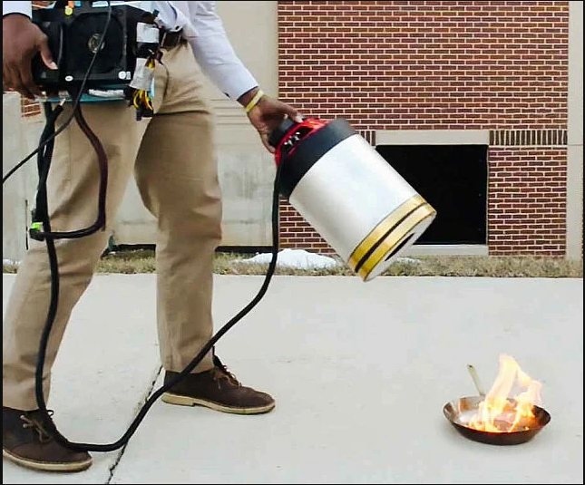
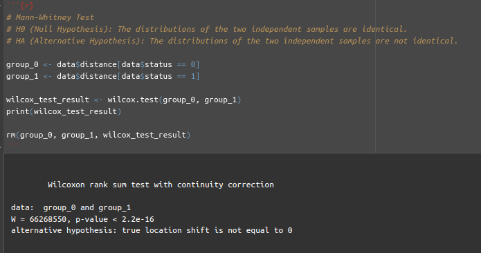
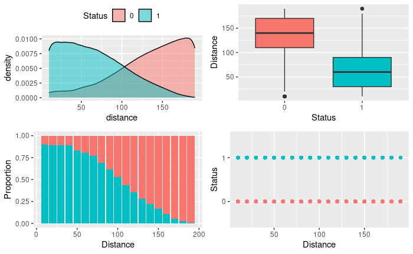

# Efficiency of Sound Wave Fire-Extinguishers

Sound wave fire-extinguishing systems are innovative technologies that utilize the power of sound waves to suppress and extinguish fires. These systems are designed to detect and combat fires rapidly and efficiently, without the use of traditional water-based methods or chemical agents.

The fundamental principle behind sound wave fire-extinguishing systems involves generating high-intensity sound waves at specific frequencies that interact with the flames, disrupting the combustion process. This interaction reduces the temperature and available oxygen in the vicinity of the fire, leading to flame suppression.

These systems offer several advantages compared to conventional fire-extinguishing methods. Some of the benefits include:

1. Waterless operation: Sound wave fire-extinguishing systems do not rely on water or chemical agents, eliminating the risks associated with water damage or chemical contamination.

2. Rapid activation: These systems can be activated quickly, detecting fires early and initiating extinguishing action promptly.

3. Enhanced safety: As there is no direct contact with flames or the use of hazardous chemicals, the safety of firefighters and other individuals involved is increased.

4. Reduced property damage: The absence of water or chemicals minimizes the potential for damage to property, such as sensitive electronic equipment, documents, and structures.

5. Efficiency in confined spaces: Sound wave fire-extinguishing systems can be particularly effective in confined spaces where traditional methods may be more challenging to apply.

It's important to note that sound wave fire-extinguishing systems are still undergoing research and development. While they show promise, further studies and testing are needed to validate their effectiveness in different fire scenarios and environments. Additionally, regulations and standards need to be established to ensure their safe and reliable implementation.

In this sense, it would be interesting to have a Ml model capable of classifying whether a fire extinguishing system using sound waves can extinguish fire, given certain conditions. 

There is a dataset [publicly available](https://www.muratkoklu.com/datasets/vtdhnd07.php), which provides the result of several experiments carried out with sound wave fire extinguishing systems. The objective of this work is to build a machine learning model capable of classifying whether a fire extinguishing system using sound waves is capable or not of extinguishing a heat source.

The dataset was obtained as a result of the extinguishing tests of four different fuel flames with a sound wave extinguishing system. The sound wave fire-extinguishing system consists of 4 subwoofers with a total power of 4,000 Watt placed in the collimator cabinet. There are two amplifiers that enable the sound come to these subwoofers as boosted. Power supply that powers the system and filter circuit ensuring that the sound frequencies are properly transmitted to the system is located within the control unit. While computer is used as frequency source, anemometer was used to measure the airflow resulted from sound waves during the extinguishing phase of the flame, and a decibel meter to measure the sound intensity. An infrared thermometer was used to measure the temperature of the flame and the fuel can, and a camera is installed to detect the extinction time of the flame. A total of 17,442 tests were conducted with this experimental setup. The experiments are planned as follows:
1. Three different liquid fuels and LPG fuel were used to create the flame.
2. 5 different sizes of liquid fuel cans are used to achieve different size of flames.
3. Half and full gas adjustment is used for LPG fuel.
4. While carrying out each experiment, the fuel container, at 10 cm distance, was moved forward up to 190 cm by increasing the distance by 10 cm each time.
5. Along with the fuel container, anemometer and decibel meter were moved forward in the same dimensions.
6. Fire extinguishing experiments was conducted with 54 different frequency sound waves at each distance and flame size.

Throughout the flame extinguishing experiments, the data obtained from each measurement device was recorded and a dataset was created. The dataset includes the features of fuel container size representing the flame size, fuel type, frequency, decibel, distance, airflow and flame extinction. Accordingly, 6 input features and 1 output feature will be used in models.

## Solution Strategy
In order to solve this challenge, the work went along the following steps:
1. **Data Description:** understanding of the status of the database and dealing with missing values properly. Basic statistics metrics provide an overview of the data.
2. **Exploratory Data Analysis (EDA):** exploration of the data searching for insights and seeking to understand the impact of each variable on the upcoming machine learning modeling.
3. **Data Preparation:** preprocessing stage required prior to the machine learning modeling step.
4. **Dimensionality reduction:** Application of techniques that aim to reduce the number of variables or attributes of the input data, seeking to simplify and optimize the model learning process.
5. **Machine Learning Modeling:** Implementation of some different models suitable for the classification task, fine-tuning their hyperparameters, using the cross-validation technique to train the models and compare their performances.

## Exploratory Data Analysis

During the exploratory data analysis several hypotheses were tested. Below are some of the hypotheses that were tested:

- **Hypothesis 1:** The distance of the extinguisher from the heat source is related to its effectiveness (success in extinguishing the fire).

***True:*** As the p-value returned by the Mann-Whitney test is less than 0.05, it is concluded that there is statistical evidence to reject that the distribution of samples between groups is identical.

From the graphs, it can be seen that as the distance increases, the proportion of cases of failure increase and the proportion of cases of success decrease.
